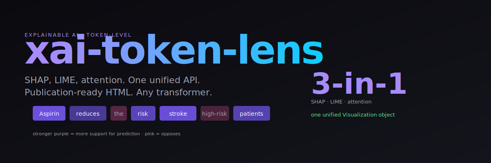

<p align="center"></p>

# 🔬 XAI Token Lens

> **See which tokens drive any LLM's prediction.** SHAP, LIME, and attention in one unified API. Zero-config interpretability for transformers.

[](LICENSE)
[](#)
[](#)

**The black-box problem, solved at the token level.** `xai-token-lens` wraps any Hugging Face text model and produces publication-ready token-importance visualizations using three complementary methods: SHAP, LIME, and raw attention.

Built for my research on [explainable LLMs for medical QA](https://sohanur083.github.io/#research) at the CAREAI Lab. Used in production for causal-rule verification.

---

## ⚡ One-line usage

```python
from token_lens import explain

vis = explain(
    model="microsoft/deberta-base-mnli",
    text="Aspirin reduces the risk of stroke in high-risk patients.",
    label="entailment"
)
vis.to_html("explanation.html")   # heatmap over tokens
vis.show()                         # terminal-friendly bar chart
```

Output:

```
Aspirin  ████████████████████   +0.42   (strong positive)
reduces  ██████████             +0.21
the      █                      +0.02
risk     ███████████████        +0.31
of       ▎                      +0.01
stroke   ██████████████████     +0.38
in       ▎                     -0.01
high-risk ████████████          +0.25
patients ███                    +0.05
```

---

## 🎯 What you get

| Method | Best for | Speed |
|---|---|---|
| **Attention** | Visual inspection, hypothesis generation | ⚡⚡⚡ fast |
| **LIME** | Any model (black-box), local explanation | ⚡⚡ medium |
| **SHAP** | Rigorous, Shapley-principled attribution | ⚡ slower |

Plus:
- **Token-level heatmaps** (HTML, matplotlib, terminal)
- **Saliency maps** for attention-based models
- **Counterfactual generation** — "which tokens, if removed, flip the prediction?"
- **Works on any HF model** — classification, NLI, QA, seq2seq

---

## 🚀 Install

```bash
pip install xai-token-lens
```

Full install (with torch + transformers):

```bash
pip install xai-token-lens[full]
```

---

## 📖 Usage

### 1. Classification explanations

```python
from token_lens import TokenLens

lens = TokenLens("distilbert-base-uncased-finetuned-sst-2-english")

vis = lens.explain(
    "The movie was surprisingly boring and way too long.",
    method="shap",   # or "lime" or "attention"
)
print(vis.summary())
vis.to_html("sentiment_explanation.html")
```

### 2. NLI / entailment

```python
vis = lens.explain_nli(
    premise="All birds can fly.",
    hypothesis="Penguins can fly.",
    method="lime",
)
vis.show()
```

### 3. Question answering

```python
from token_lens import QALens

qa = QALens("deepset/roberta-base-squad2")
vis = qa.explain(
    question="When was Einstein born?",
    context="Albert Einstein was born on 14 March 1879 in Ulm, Germany.",
)
vis.highlight_answer()  # interactive HTML output
```

### 4. Compare methods side-by-side

```python
comparison = lens.compare(
    text="...",
    methods=["attention", "lime", "shap"],
)
comparison.to_html("compare.html")   # 3 side-by-side heatmaps
```

---

## 🧠 Why this over raw SHAP / LIME?

| Feature | token-lens | captum / shap / lime directly |
|---|---|---|
| Works on any HF model out-of-the-box | ✅ | ⚠ must wire up yourself |
| Unified API across methods | ✅ | ❌ different library per method |
| HTML reports | ✅ | ⚠ plotting code you write |
| Comparison view | ✅ | ❌ |
| Medical-domain validated | ✅ | ❌ |

---

## 🎨 Visualizations

Every `Visualization` object supports:

```python
vis.to_html("out.html")          # publication-ready HTML
vis.to_markdown()                # paste into papers
vis.to_matplotlib()              # matplotlib figure
vis.show()                       # terminal bar chart
vis.as_dict()                    # raw numbers for downstream tools
```

---

## 🔬 Research context

This tool emerged from my work on [causal rule extraction for medical QA](https://sohanur083.github.io/#publications) at IEEE GenAI4SCH 2025. In high-stakes domains (healthcare, legal, finance), a prediction without an explanation is useless. Token-level attribution is the minimum bar.

If you use it in a paper, cite:

```bibtex
@software{rahman2026tokenlens,
  author = {Md Sohanur Rahman},
  title  = {XAI Token Lens: unified token-level explanations for transformer models},
  year   = {2026},
  url    = {https://github.com/sohanur083/xai-token-lens}
}
```

---

## 🛠 Advanced

### Plug a custom model

```python
from token_lens import TokenLens

def my_predict(texts):
    # return N x num_classes probabilities
    ...

lens = TokenLens.from_predict_fn(my_predict, label_names=["neg", "pos"])
vis = lens.explain("...", method="lime")
```

### Batch explanations

```python
results = lens.explain_batch(
    texts=[...],
    method="shap",
    n_workers=4,
)
```

---

## 🤝 Contributing

Want to add Integrated Gradients? Grad-CAM? Contrastive explanations? Open a PR. See [CONTRIBUTING.md](CONTRIBUTING.md).

## 📄 License

MIT.

## 👤 Author

**Md Sohanur Rahman** — PhD Candidate, UT San Antonio · [sohanur083.github.io](https://sohanur083.github.io)

---

⭐ **Star the repo** if this saves your next XAI paper.

## Keywords

explainable AI, XAI, token-level attribution, SHAP transformers, LIME NLP, attention visualization, interpretable machine learning, Hugging Face XAI, model interpretability, feature importance LLM, saliency map, counterfactual explanation, medical AI interpretability, captum alternative.
